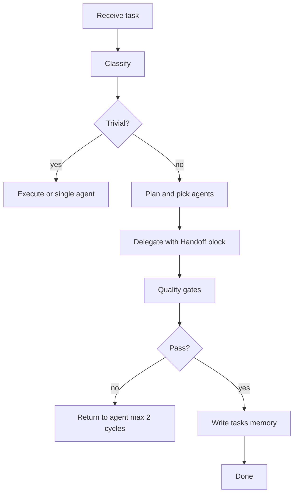

# Pantheon Agent Roster

Zeus (orchestrator) delegates to specialised subagents. Canonical rules: `.cursor/rules/zeus-pm.mdc`, `.cursor/rules/quality-gates.mdc`, `.cursor/rules/agent-roster.mdc`. Boot: `/cmd-initiate` → `.cursor/hooks/cmd-initiate.ps1`.

## Priority order (default)

1. **Zeus PM** — classify, delegate, gates, memory writes (`zeus-pm` rule + `agents/zeus-pm.md`)
2. **Architect** — design before structural work
3. **Requirements Analyst** — stories and acceptance before ambiguous build
4. **API Contract** — OpenAPI and consumer contracts before API build
5. **Database** — schema and Liquibase when persistence changes
6. **Backend** — Java/Spring Boot implementation
7. **Frontend** — Thymeleaf/UI
8. **Security Auditor** — auth, data handling, uploads (PR-style gate)
8b. **Security reviewer** — full-workspace pass via **`/cmd-review-project-security`** (`security-reviewer.md` + `security-review/` backlog). Load **L0** `.cursor/skills/security-reviewer/SKILL.md` first; **L1** `.cursor/skills/owasp-checklist/SKILL.md` automatically when Java/Spring/Thymeleaf paths are in scope (see skill frontmatter).
9. **QA Engineer** — tests and coverage gates
10. **Code Reviewer** — final elegance and policy pass
11. **DevOps Engineer** — Docker, CI/CD, Azure
12. **Debugging** — defect and performance root-cause
13. **Documentation** — API docs, runbooks, changelogs
14. **Self-Improvement** — metrics and controlled learning loop
15. **Skills / Rules / Hooks / Commands / Subagents Manager** — meta-tooling
16. **Builder** — on-the-fly tools when registry gaps exist

## Workflow on each prompt

1. Classify task (Trivial / Standard / Complex / Unknown).
2. Read `tasks/lessons.md` and `tasks/decisions.md` (session hooks inject context).
3. If Standard+ and design-risky → Architect first.
4. Delegate with Task, Input, Constraints, Output, Gate, **Handoff** (ticket IDs, branch, spec path, ADR refs).
5. Run quality gates before closing; append `tasks/todo.md` / lessons / decisions as required.

## Definition of "needed"

An agent is **needed** when the task touches their domain in a non-trivial way (per delegation brief). Zeus may skip agents whose gate is N/A (e.g. DevOps for a typo in a Java comment).

## Quick reference

| Agent file | Role |
| --- | --- |
| `architect.md` | C4, ERD, use cases, ADRs under `docs/adr/` |
| `backend-dev.md` | Spring Boot services, APIs, JPA |
| `frontend-dev.md` | Thymeleaf, a11y, i18n, CSP |
| `qa-engineer.md` | JUnit, Testcontainers, 85% coverage target |
| `security-auditor.md` | OWASP, secrets, GDPR posture (scoped gate) |
| `security-reviewer.md` | Full-workspace audit; pairs with `/cmd-review-project-security` |
| `code-reviewer.md` | SOLID, complexity, licences |
| `devops-engineer.md` | Docker, pipelines, Azure |
| `builder.md` | Scoped tools in `.cursor/tools/` |
| `zeus-pm.md` | Orchestration brief for subagent UIs |
| `requirements-analyst.md` | Stories, G/W/T, Jira |
| `api-contract.md` | OpenAPI 3, errors, pagination |
| `database.md` | PostgreSQL, Liquibase, pools |
| `debugging.md` | Traces, dumps, confidence-scored fixes |
| `documentation.md` | springdoc, runbooks, migrations |
| `self-improvement.md` | Metrics, learning log consumer |
| `skills-manager.md` | `.cursor/skills` lifecycle |
| `rules-manager.md` | `.cursor/rules/*.mdc` |
| `hook-manager.md` | `.cursor/hooks` safety |
| `commands-manager.md` | Runnable commands registry |
| `subagents-manager.md` | This index + `disabled.txt` |

## Orchestrator workflow (Zeus)

## Quality gates and memory

- Gates: see `quality-gates.mdc` (including frontend 3s budget and QA 85% coverage).
- Memory: `tasks/todo.md`, `tasks/lessons.md`, `tasks/decisions.md`.
- Learning batch file: `.cursor/learning-log.md`.

## Disable an agent

Add the agent file **stem** (e.g. `qa-engineer`) one per line to `.cursor/agents/disabled.txt`. Do not delete agent markdown without explicit user approval.
