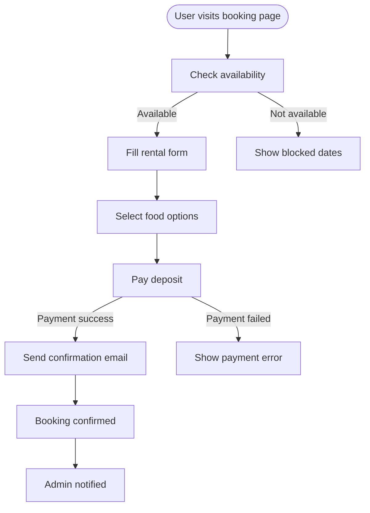
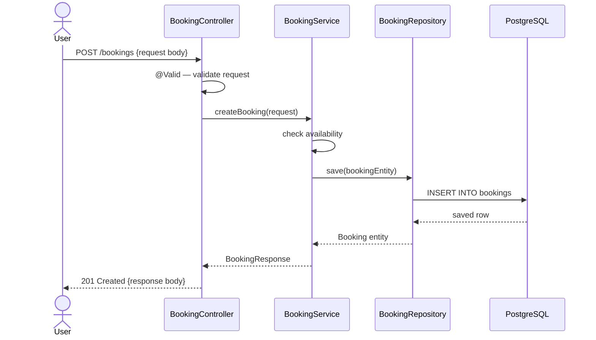
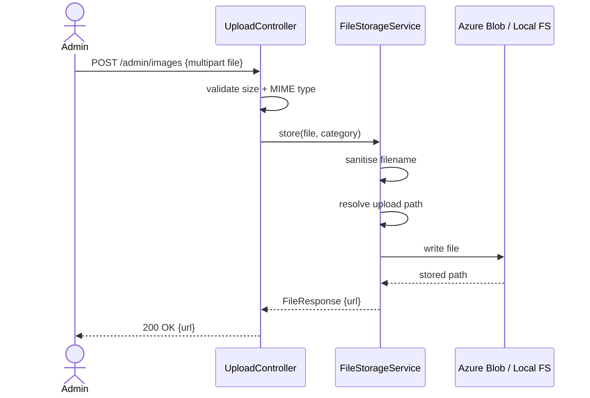
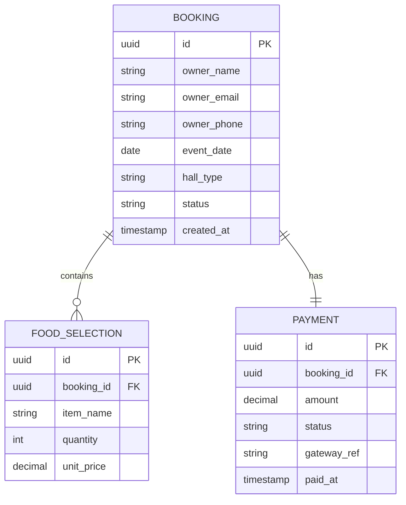
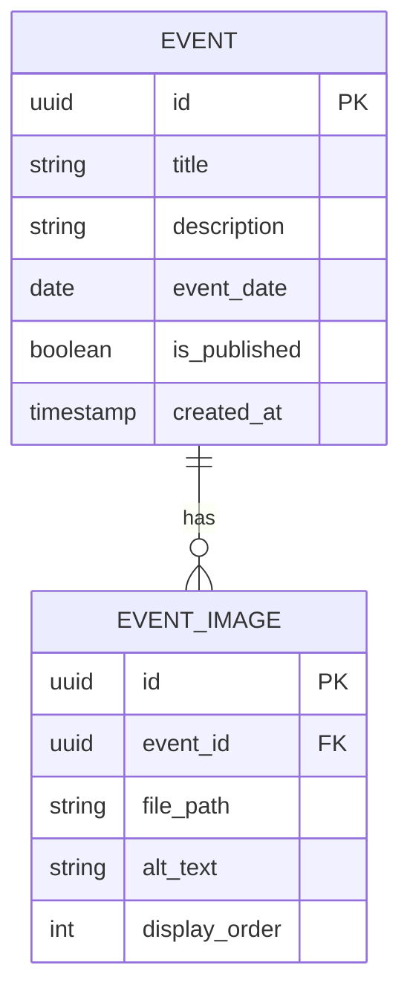

# Mermaid Diagram Patterns

## When to Use

- Architect agent outputs, ADR appendices, or documentation updates that need structural visuals.
- Any time stakeholders need a shared picture of boundaries, sequences, data, or **who** achieves **what** with the system (use cases).

## C4-style views (use separate diagrams)

| Level | Mermaid approach | Purpose |
| --- | --- | --- |
| **Context** | `flowchart` with system vs users/external deps | Show system boundary in environment |
| **Container** | `flowchart` / `C4Container` if using compatible renderer | Apps, databases, queues |
| **Component** | `flowchart` inside one deployable | Major modules/services inside a container |

> Cursor renders core Mermaid; if your toolchain supports `C4Context` etc., prefer those — otherwise emulate with labelled `flowchart` nodes.

## ADR storage convention

- File ADRs under `docs/adr/` (e.g. `docs/adr/0001-record-architecture-decisions.md`) and link from `tasks/decisions.md` summaries.

## Diagram type selector

| What to show | Diagram type |
|---|---|
| Request/response flow, process steps | `flowchart TD` |
| API call sequence between layers | `sequenceDiagram` |
| Database schema, entity relationships | `erDiagram` |
| System modules and dependencies | `flowchart LR` |
| **Actors, goals, system boundary (UML use case view)** | `usecaseDiagram` |

> **`usecaseDiagram`** needs a recent Mermaid build (diagram type added in Mermaid 11.x). If your preview or CI renderer errors, fall back to a `flowchart` with `(Actor)` ovals and `[Use case name]` rectangles inside a labelled subgraph for the system boundary.

---

## Use case diagram — actor goals and boundary

Use when you need a **UML-style use case view**: primary actors, the system boundary, named use cases, and optionally «include» / «extend» style relationships where your Mermaid version supports them.

```mermaid
usecaseDiagram
  actor Visitor as "Visitor"
  actor Admin as "Admin"
  system "Temple site" {
    usecase Browse as "Browse events"
    usecase Book as "Book hall"
    usecase Publish as "Publish event"
  }
  Visitor --> Browse
  Visitor --> Book
  Admin --> Publish
```

---

## Flowchart — Spring Boot request lifecycle

```mermaid
flowchart TD
    Client([Client]) -->|HTTP Request| Filter[Security Filter Chain]
    Filter -->|Authenticated| Controller[@RestController]
    Filter -->|Rejected| Err401[401 Unauthorized]
    Controller -->|DTO| Service[@Service]
    Service -->|Entity| Repository[@Repository]
    Repository -->|SQL| DB[(PostgreSQL)]
    DB -->|Result| Repository
    Repository -->|Entity| Service
    Service -->|Business logic| Service
    Service -->|Response DTO| Controller
    Controller -->|JSON| Client
    Service -->|Exception| Handler[@ControllerAdvice]
    Handler -->|Error response| Client
```

## Flowchart — Rental booking flow (temple project)



---

## Sequence diagram — Controller to DB



## Sequence diagram — File upload flow



---

## ERD — Rental booking schema



## ERD — Event and image schema



---

## Rules for all diagrams

- For **use case** diagrams: name actors and use cases from the user’s vocabulary; keep one system boundary per diagram unless you split by epic deliberately.
- Label every arrow — unlabelled arrows require the reader to guess
- Use `([text])` for actors/users (rounded stadium shape)
- Use `[(text)]` for databases (cylinder shape)
- Use `[text]` for processes/classes (rectangle)
- Use `{text}` for decisions (diamond) in flowcharts
- Keep each diagram to one concern — split complex flows into multiple diagrams
- TD (top-down) for process flows, LR (left-right) for system architecture
- After producing a diagram, read it back — does the flow make sense without explanation?

## Safety Checklist

- [ ] Diagram matches current code boundaries (not aspirational unless labelled)
- [ ] No secrets or internal hostnames that should not be shared in client-visible docs
