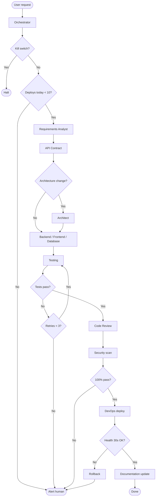

# Activity Diagram – Multi-Agent Pipeline

```mermaid
flowchart TD
    Start([User request]) --> Orchestrator
    Orchestrator --> CheckKill{Kill switch?}
    CheckKill -->|Yes| Halt([Halt])
    CheckKill -->|No| CheckDeploy{Deploys today < 10?}
    CheckDeploy -->|No| AlertHuman([Alert human])
    CheckDeploy -->|Yes| Req[Requirements Analyst]
    Req --> API[API Contract]
    API --> Arch{Architecture change?}
    Arch -->|Yes| Architect[Architect]
    Arch -->|No| Backend[Backend / Frontend / Database]
    Architect --> Backend
    Backend --> Test[Testing]
    Test --> TestPass{Tests pass?}
    TestPass -->|No| Retry{Retries < 3?}
    Retry -->|Yes| Test
    Retry -->|No| AlertHuman
    TestPass -->|Yes| Review[Code Review]
    Review --> Sec[Security scan]
    Sec --> SecPass{100% pass?}
    SecPass -->|No| AlertHuman
    SecPass -->|Yes| Deploy[DevOps deploy]
    Deploy --> Health{Health 30s OK?}
    Health -->|No| Rollback[Rollback]
    Health -->|Yes| Doc[Documentation update]
    Rollback --> AlertHuman
    Doc --> End([Done])
```
