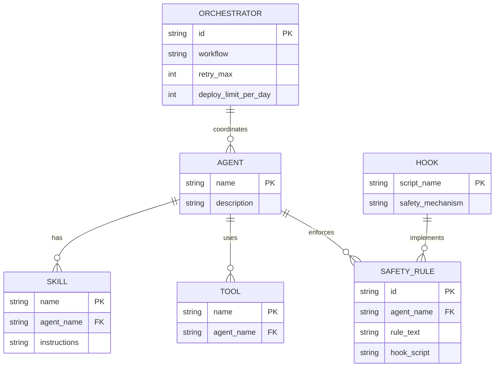

# ER Diagram – Agents, Skills, Tools, Safety

## Entity summary

| Entity | Description |
|--------|-------------|
| **AGENT** | One per role (Orchestrator, Architect, Backend, etc.); has many skills, tools, safety rules. |
| **SKILL** | SKILL.md content; step-by-step instructions for an agent. |
| **TOOL** | Cursor, Mermaid, Jira, Postman, Docker, etc. |
| **SAFETY_RULE** | Non-negotiable rule (e.g. 3 retries, 10 deploys/day); may be enforced by a hook. |
| **ORCHESTRATOR** | Workflow definition; retry and deploy limits. |
| **HOOK** | Script (e.g. deploy-rate-limit.ps1) that implements a safety mechanism. |
