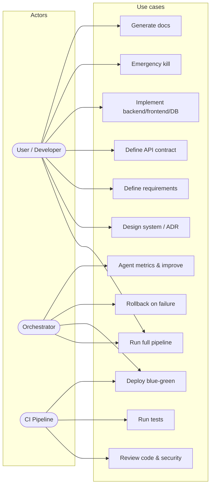

# Use Case Diagram – Multi-Agent Framework

```mermaid
flowchart LR
    subgraph Actors
        User([User / Developer])
        Orchestrator([Orchestrator])
        CI([CI Pipeline])
    end

    subgraph UseCases["Use cases"]
        UC1[Run full pipeline]
        UC2[Design system / ADR]
        UC3[Define requirements]
        UC4[Define API contract]
        UC5[Implement backend/frontend/DB]
        UC6[Review code & security]
        UC7[Run tests]
        UC8[Deploy blue-green]
        UC9[Rollback on failure]
        UC10[Emergency kill]
        UC11[Generate docs]
        UC12[Agent metrics & improve]
    end

    User --> UC1
    User --> UC2
    User --> UC3
    User --> UC4
    User --> UC5
    User --> UC10
    Orchestrator --> UC1
    Orchestrator --> UC8
    Orchestrator --> UC9
    CI --> UC6
    CI --> UC7
    CI --> UC8
    User --> UC11
    Orchestrator --> UC12
```
