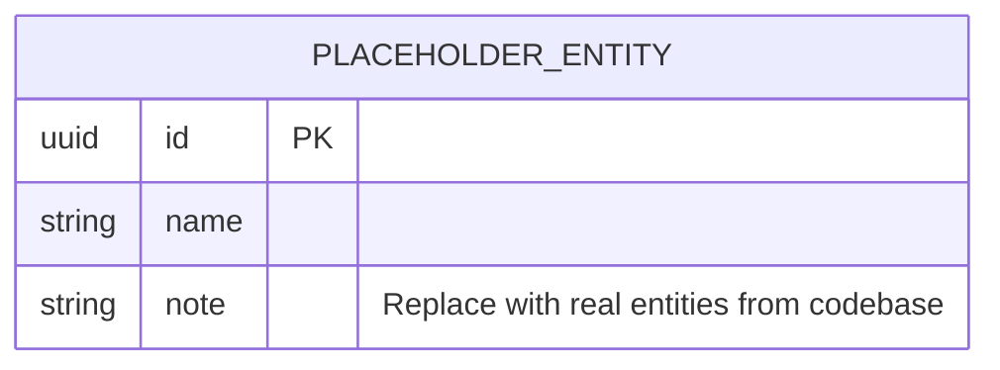

# ER diagram

```mermaid
erDiagram
  PLACEHOLDER_ENTITY {
    uuid id PK
    string name
    string note "Replace with real entities from codebase"
  }
```

## Evidence

- _None — template until `/cmd-uml-diagrams` is run against the real model._
