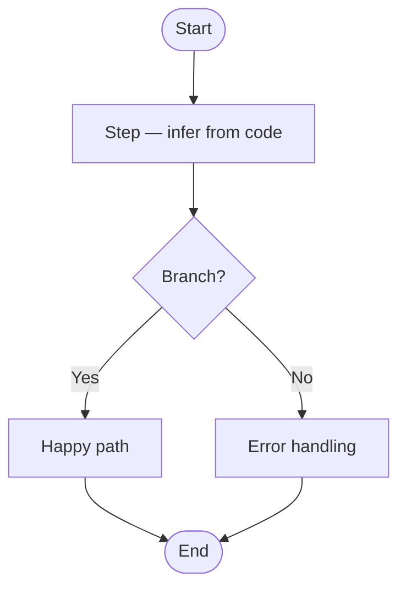

# Flow diagram

```mermaid
flowchart TD
  Start([Start]) --> Step1[Step — infer from code]
  Step1 --> Decision{Branch?}
  Decision -->|Yes| Ok[Happy path]
  Decision -->|No| Err[Error handling]
  Ok --> End([End])
  Err --> End
```

## Evidence

- _None — template until `/cmd-uml-diagrams` is run._
