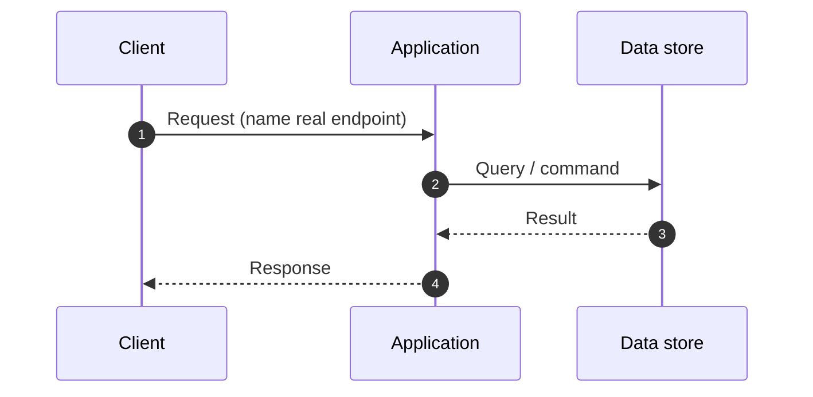

# Sequence diagram

```mermaid
sequenceDiagram
  autonumber
  participant Client
  participant App as Application
  participant Data as Data store
  Client->>App: Request (name real endpoint)
  App->>Data: Query / command
  Data-->>App: Result
  App-->>Client: Response
```

## Evidence

- _None — template until `/cmd-uml-diagrams` is run._
