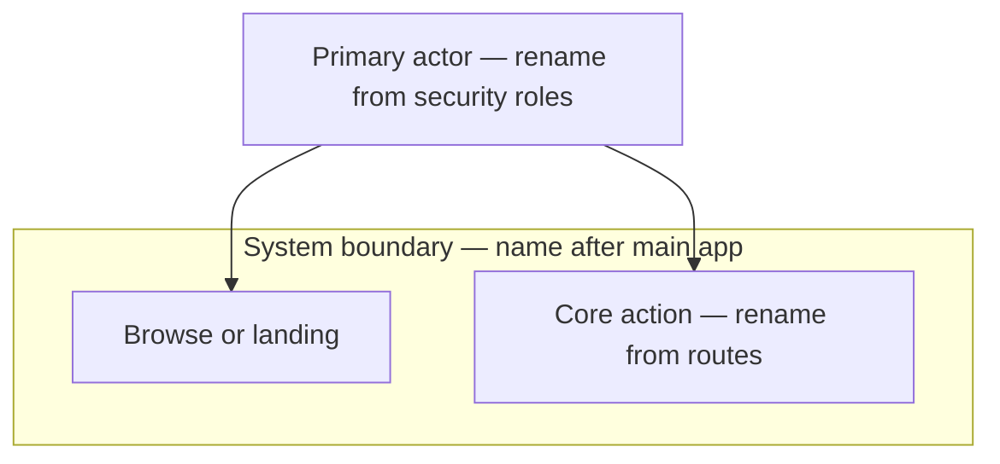

# Use case diagram

> **Note:** “User diagram” in UML usually means **use case** (actors + goals). If you need personas only, extend Evidence and add a journey in `flow-diagram.md`.

## Evidence

- _None — template until `/cmd-uml-diagrams` is run._
